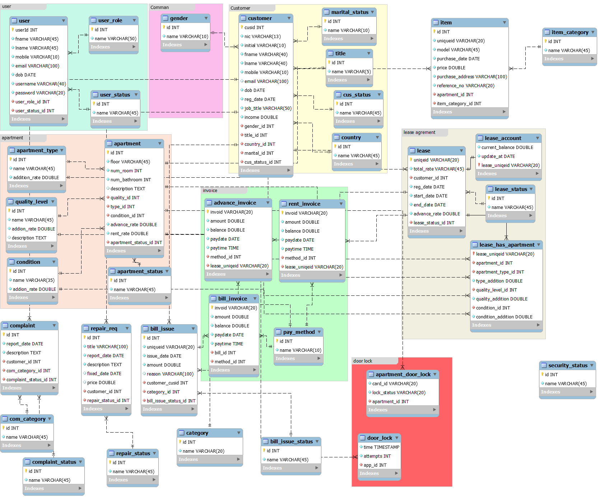
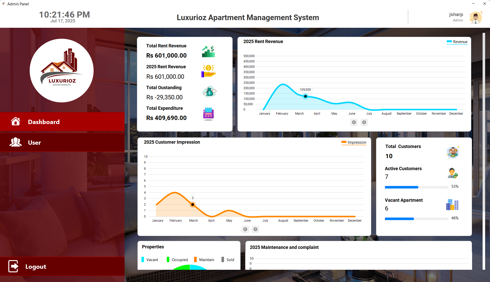
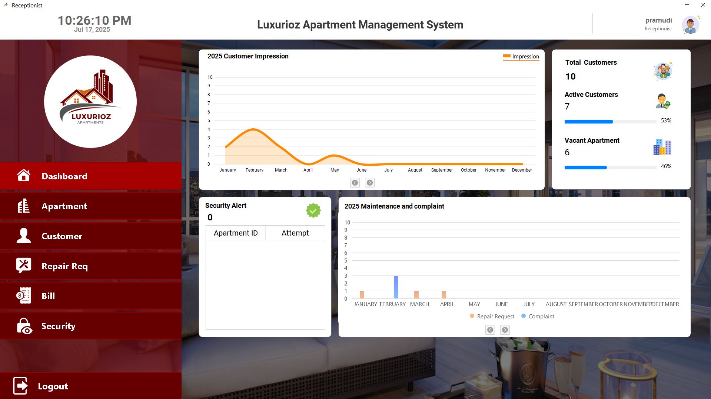
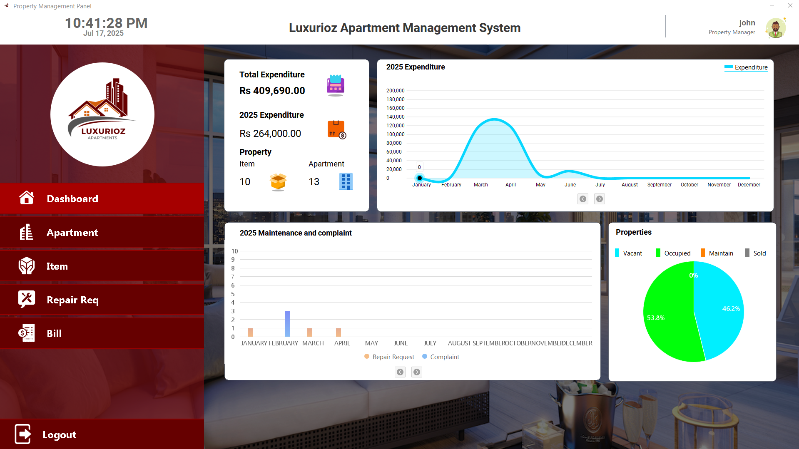
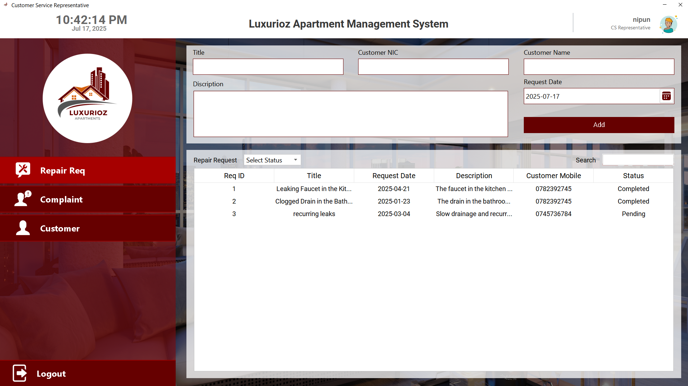
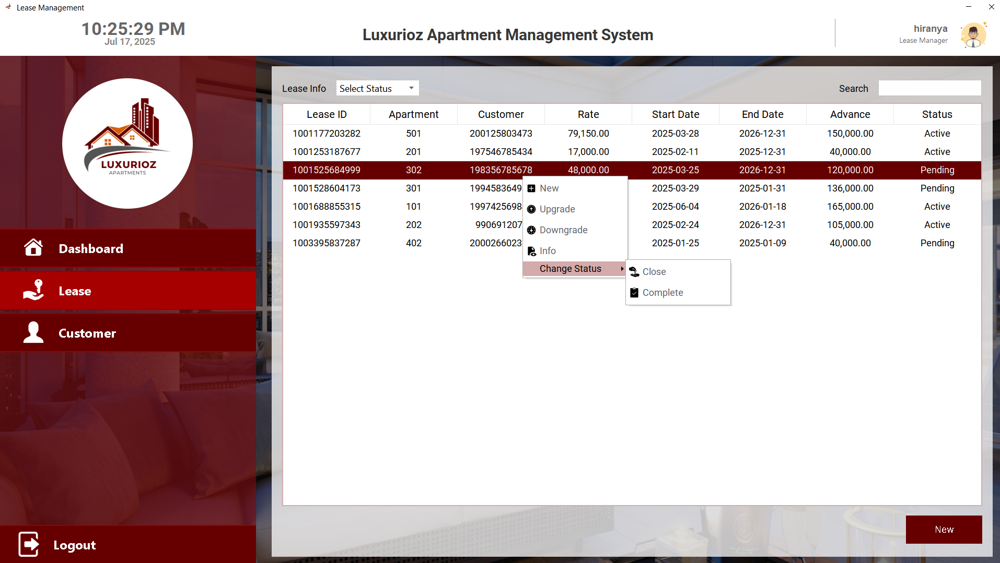
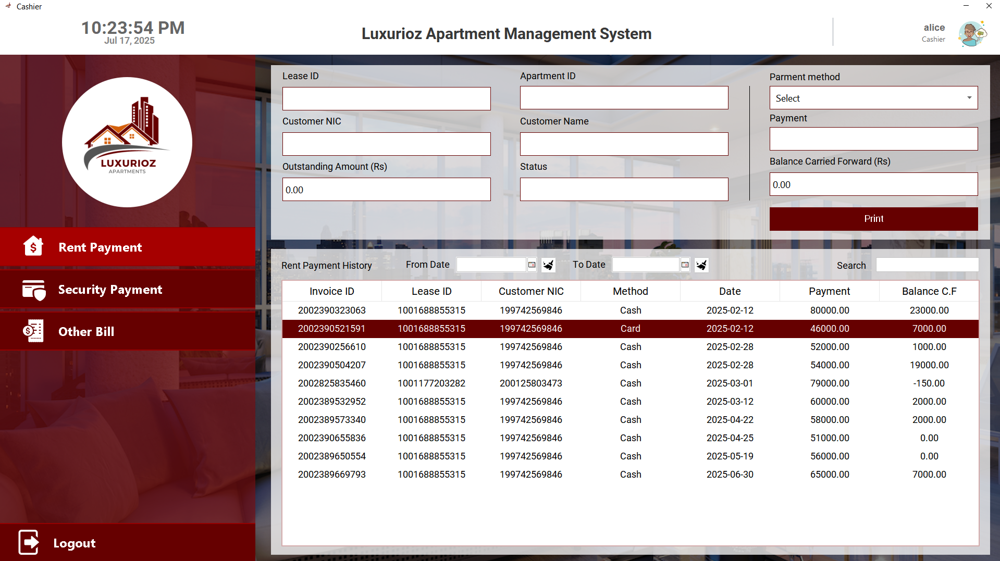

# Advanced Apartment Management System

A Java-based desktop application designed to streamline apartment management with role-based interfaces for Admin, Receptionist, Property Manager, Lease Agent, Customer Service, and Cashier. The system enhances efficiency in managing apartments, tenants, payments, maintenance, and security integrations.

## Table of Contents
- [Project Overview](#project-overview)
- [Key Features](#key-features)
- [Role-Based Authorizations](#role-based-authorizations)
- [System Architecture](#system-architecture)
- [Screenshots](#screenshots)
- [Sample Documents](#sample-documents)
## Project Overview
The Advanced Apartment Management System is a comprehensive solution for managing apartment complexes. Built using Java, it provides a user-friendly interface for various roles to handle tasks like apartment inventory, tenant management, rent calculations, maintenance tracking, and financial reporting. The system supports six distinct roles with specific authorizations and integrates with smart door lock systems for enhanced security.

## Key Features
1. **Apartment Inventory and Availability**
   - Maintains a detailed database of apartments, including specifications and amenities (e.g., pool, furniture, elevator, electronic devices).
   - Real-time tracking of apartment availability for accurate tenant information.

2. **Rent Calculation**
   - Intelligent rent calculation based on apartment quality, amenities, location, size, and market trends.
   - Flexible pricing adjustments for dynamic rental strategies.

3. **Tenant Management**
   - Comprehensive tenant records, including lease agreements and rental history.
   - Streamlined onboarding and lease renewal processes.

4. **Maintenance and Repair Tracking**
   - Tenant-submitted maintenance requests with categorized priority levels.
   - Efficient tracking for timely issue resolution.

5. **Customer Inquiry Management**
   - Ticketing system for handling customer inquiries and complaints.

6. **Financial Management**
   - Automated generation of invoices for rent, security deposits, damage charges, and parking fees.
   - Tracks rental income, expenses, and outstanding payments.
   - Generates financial reports for property owners and managers.

7. **Security and User Access**
   - Role-based access control for secure operations.
   - Integration with smart door lock systems, with alerts for unauthorized access.

8. **Reports and Bills**
   - Automated monthly rent invoices and bills for additional charges (e.g., damage, parking).
   - System-generated lease agreement documents.

## Role-Based Authorizations
| Role                | Responsibilities                                                                 |
|---------------------|---------------------------------------------------------------------------------|
| **Admin**           | Add/update/delete apartments, manage users, update rental rates                  |
| **Property Manager**| Add/update items, manage repairs, issue damage bills                            |
| **Receptionist**    | Handle reservations, lease agreements, check apartment availability              |
| **Cashier**         | Accept payments                                                                |
| **Customer Service**| Add repair requests, manage customer complaints                                 |
| **Leasing Agent**   | Enter/renew leasing agreements                                                 |

## System Architecture
The system follows a modular architecture with a Java-based desktop application connected to a relational database. Below is the Entity-Relationship (ER) diagram illustrating the database structure:

### ER Diagram Description
- **Entities**: Apartments, Tenants, Leases, Payments, Maintenance Requests, Users, Invoices.
- **Relationships**: Tenants are linked to Leases, which are associated with Apartments. Payments and Maintenance Requests are tied to Tenants and Apartments. Users have role-based access levels.

## Screenshots
Below are key UI/UX screenshots showcasing the system's interfaces for different roles:

| Admin Dashboard | Receptionist Interface |
|-----------------|-----------------------|
|  |  |

| Property Manager Interface | Customer Service Interface |
|----------------------------|----------------------------|
|  |  |

| Leasing Agent Interface | Cashier Interface |
|------------------------|-------------------|
|  |  |

*Note*: Place the actual screenshot images in the `resource/screenshots/` folder and the ER diagram in the `resource/ER-dagram/` folder of the repository.

## Sample Documents
Sample invoice and lease agreement documents generated by the system can be viewed in the `resources/sample-report` folder:
- [Sample Invoice](resource/sample-report/1701270307665.pdf)
- [Sample Lease Agreement](resource/sample-report/1001688855315.docx)
